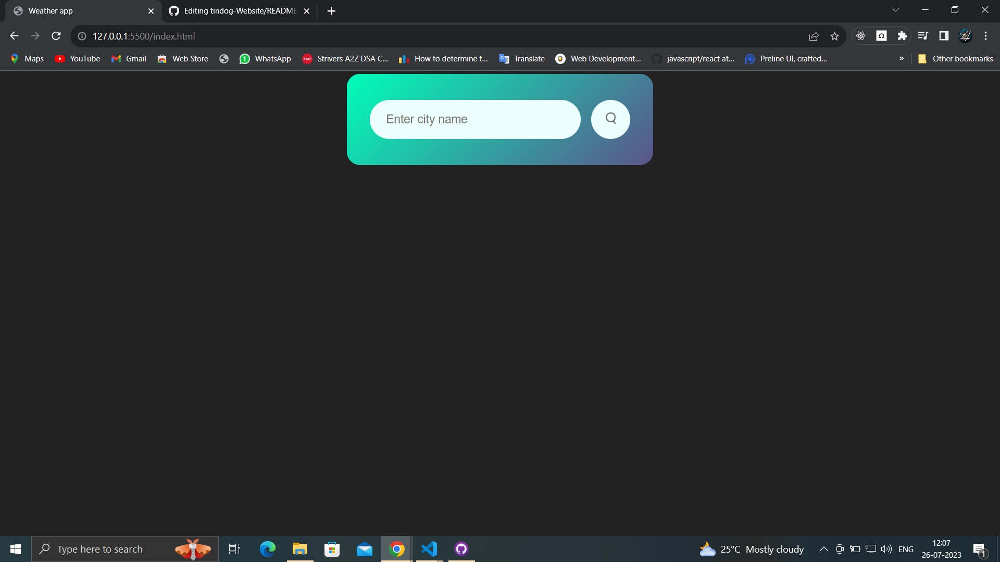
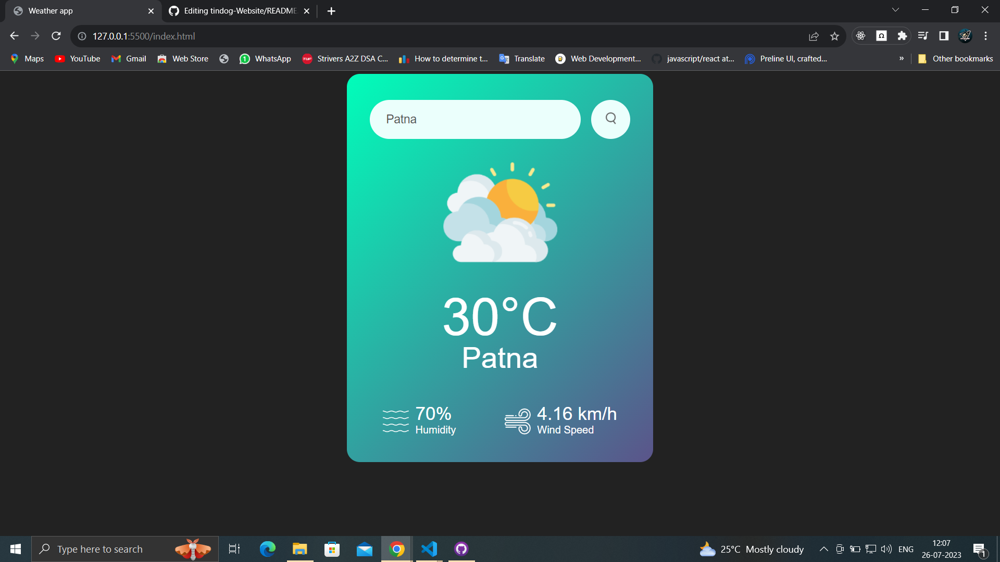

#  Weather App

This is a simple weather app that I created using HTML, CSS, and JavaScript. It allows users to enter their location and see the current weather conditions for that location.

To use the app, simply enter your location in the text box and click the "Search" icon. 


## Overview


### Screenshot






### Links


- Live Site URL: [Github Pages](https://shwetakshipriya.github.io/Weather_app//)

## My process

### Built with

- HTML5
- CSS custom properties
- Javascript
- Openweather Map API


### What I learned
In this project, I learned how to create a simple weather app using HTML, CSS, and JavaScript. I also learned how to use the OpenWeatherMap API to get weather data for a given location. This was a great learning experience, and I am excited to continue learning more about web development.

Some code snippet for fun 😀:

```html
<h1>Its raining outside.</h1>
```
```css
.proud-of-this-css {
  color: sunny;
}
```
```js
const clouds = () => {
  console.log('☁')
}
```


## Author

- Github Profile Link - [shwetakshipriya](https://github.com/shwetakshipriya)
- Linkdin - [@shwetakshi-priya](https://www.linkedin.com/in/shwetakshi-priya-1160b623a/)
- Instagram - [@shwetakshipriya](https://www.instragram.com/shwetakshipriya )


## Acknowledgments

Thanks for reading this far, if you have any suggestions or feedback, please let me know in the comments below. I would love to hear from you.
